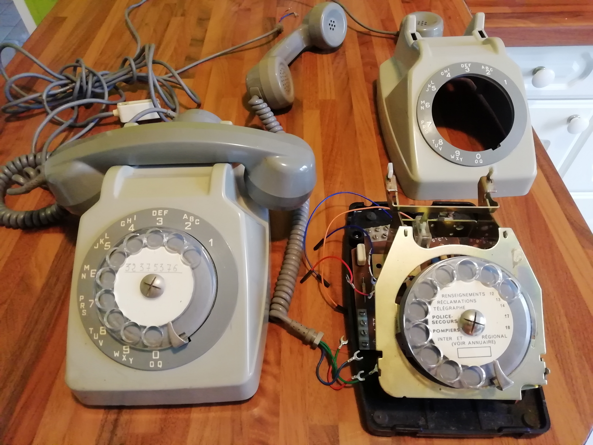
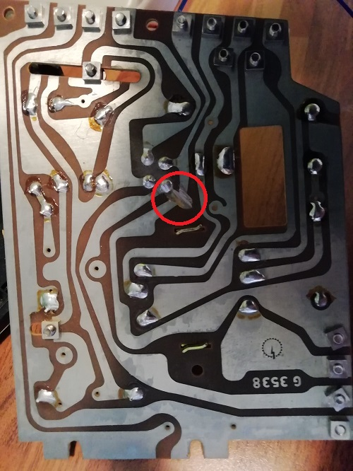

# Passer des appels et en recevoir avec un Socotel S63
# WORK IN PROGRESS

Table des matières
==================

   * [introduction](#introduction)
   * [objectif du projet](#objectif-du-projet)
   * [réalisation par étape](#réalisation-par-étape)
       * [étape préliminaire : étude du matériel utilisé](#étape-préliminaire-:-étude-du-matériel-utilisé)
       * [étape 1 : interfacer le S63 avec le rasperry](#étape-1-:-interfacer-le-S63-avec-le-rasperry) 
       * [étape 2 : voix sur IP](#étape-2-:-voix-sur-IP)
       

* [Remerciements et références](#remerciements-et-références)

## introduction 

De nombreuses réalisations sont disponibles sur le net pour transformer les vieux téléphones à cadran.
Mais je n'ai pas trouvé exactement ce que je veux réaliser, je vais donc m'inspirer de ce qui existe et adapter.
* [hnesland](https://github.com/hnesland/aselektriskbureau) : utilisation d'une pile voix sur IP sur un téléphone à cadran AS Elektrisk Bureau
* [ThomasChappe](https://github.com/ThomasChappe/S63_Arduino) : Socotel S63 interfacé à un arduino
* [revolunet](http://github.com/revolunet/s63) : Socotel S63 interfacé à Rasperry Pi 3

## objectif du projet
Pouvoir utiliser un téléphone Socotel S63 pour passer et recevoir des appels

L'idée est d'utiliser le micro et les haut parleurs du Socotel S63 pour la partie son et de trouver un moyen de réaliser la partie téléphonie.

Les spécifications sont :
* décrocher/raccrocher du combiné fonctionnel
* émission des tonalités France Télécom d'époque
* utilisation du micro et haut parleur du combiné + écouteur
* utilisation du cadran rotatif pour composer le numéro
* sonerie d'origine fonctionnelle

## réalisation par étape

Chaque étape me permet d'acquerir de nouvelles compétence et d'arriver à un résultat encourageant.
De nombreux projets sur github interfacent un raspberry avec un Socotel S63.
J'ai trouvé un projet qui implémente une pile voix sur IP sur un téléphone vintage d'un autre pays, il faut donc adapter ce projet au S63.
J'ai également trouvé une implémentation d'une pile téléphonie sur un rasperry, reste plus qu'à recoller tous les morceaux...

### étape préliminaire : étude du matériel utilisé 

#### Socotel S63

Une description complète de ce téléphone est disponible sur le site d'[alain.levasseur](#http://alain.levasseur.pagesperso-orange.fr/page22.htm)

Le site [revolunet](http://github.com/revolunet/s63) trés clair et trés complet donne notamment le schéma électrique du S63.

#### raspberry pi et ses accessoires

Il existe de nombreux modèles de rapberry Pi, le [site suivant](https://socialcompare.com/fr/comparison/raspberrypi-models-comparison) permet une vue synthètique des différences entre modèles.
La puissance CPU et la quantité de RAM ne sont pas des critères pertinents car le raspberry sera utilisé sans interface graphique avec peu de paquets installés.
Quelque soit le modèle choisi, voici les fonctionnalités dont nous aurons besoin
* interface réseau
    * ethernet (c'est plus facile pour commencer)
    * wifi (c'est plus pratique que le cable ethernet)
* sortie audio
* entrée microphone
* connexion bluetooth

Comme aucun modèle de raspberry ne permet de connecter un microphone, nous serons obligé de passer par une carte son externe en USB.

Je dispose de vieux Rasperry Pi B, ils feront très bien l'affaire pour commencer.
Par la suite pour les connexion wifi et bluetooth, il faudra soit
* un Rasperry Pi intégrant ces fonctions (raspberry Pi 3 ou Rasperry Zero W)
* des dongles USB Wifi et Bluetooth

voici le matériel que je commande
* [2 cartes SD 32Go](https://www.amazon.fr/gp/product/B00MSQYX8Y/ref=ppx_yo_dt_b_asin_title_o00_s00?ie=UTF8&psc=1) (8Go pourrait suffire)
* une [carte son USB](https://www.ebay.fr/itm/USB-2-0-Virtual-7-1-Channel-Audio-Sound-Card-Adapter-For-Laptop-PC-MAC-New/142306561110?ssPageName=STRK%3AMEBIDX%3AIT&_trksid=p2060353.m2749.l2649)
* une [clé wifi USB](https://www.ebay.fr/itm/150Mbps-Speed-Usb-Wireless-Wifi-802-11N-Lan-Adapter-Dongle-For-Raspberry-Pi/352895785136?ssPageName=STRK%3AMEBIDX%3AIT&_trksid=p2060353.m2749.l2649)
* une [clé Bluetooth USB](https://www.ebay.fr/itm/Bluetooth-4-0-USB-2-0-Dongle-Adapter-for-Raspberry-Pi-CSR-4-0/112759618905?ssPageName=STRK%3AMEBIDX%3AIT&_trksid=p2060353.m2749.l2649)
Compte tenu du prix, je prend le risque d'avoir du matériel qui soit mal supporté par raspbian, quitte a recommander ultérieurement du matériel plus cher mais qui a été testé par d'autres utilisateurs.

#### connectique 

Le combiné du Socotel S63 et l'écouteur seront connectés à la carte son USB.
Il faut donc prévoir des des connecteurs jack 3.5mm et un slitter.
* [connecteur jack à souder](https://www.ebay.fr/itm/1pc-3-5mm-3-Pole-Headphone-Replacement-Audio-Jack-Male-Plug-Solder-Connector/142869621639?ssPageName=STRK%3AMEBIDX%3AIT&var=441859923249&_trksid=p2060353.m2749.l2649)
* [slitter jack](https://www.ebay.fr/itm/3-5mm-Stereo-Y-Splitter-Audio-Adapter-1-8-Male-Plug-to-2-Dual-Female-Jacks-XC/233228336729?ssPageName=STRK%3AMEBIDX%3AIT&_trksid=p2060353.m2749.l2649

#### composants électroniques

Je souhaite rendre fonctionnel la sonnerie d'origine.
Le site [ThomasChappe](https://github.com/ThomasChappe/S63_Arduino#on-va-plus-loin--on-peut-le-faire-sonner-) détail tout le matériel nécessaire. Je commande donc
* des [solénoides](https://fr.aliexpress.com/item/32801392552.html)
* des [transistors](https://www.ebay.fr/itm/10pcs-TIP102-NPN-SILICON-POWER-DARLINGTONS-TO-220/181089170269?ssPageName=STRK%3AMEBIDX%3AIT&_trksid=p2060353.m2749.l2649)
* des [resistances](https://www.ebay.fr/itm/10-20-ou-50-Diode-de-redressement-1N4004-1A-400V-DO-41-DIY-Arduino-PI/322431805132?ssPageName=STRK%3AMEBIDX%3AIT&var=511405892757&_trksid=p2060353.m2749.l2649)

### étape 1 : interfacer le S63 avec le rasperry 

Objectifs :
* valider le schéma de cablage
* faire tourner un Rasperry Pi interfacé avec les Socotel S63
* obtenir un premier code python qui
    * gere l'interface Raspberry - S63
    * gestion du décrocher/raccrocher
    * gestion de la numérotation avec le cadran

Le Rasperry Pi B connecté en Ethernet permet de commencer le projet en douceur.
L'installation du Rasperry est décrite [ici](https://raspberry-pi.fr/raspberry-pi-sans-ecran-sans-clavier/).

Comme je suis plus à l'aise en python, le site [hnesland](https://github.com/hnesland/aselektriskbureau) me donne les premières base du code source.

Petite surprise je ne confirme pas tout à fait les informations de [revolunet](http://github.com/revolunet/s63) : 
  - si on détecte le décrocher/raccrocher via les connexions 7 et 11 du S63, le signal n'est pas franc

Apres débuggage, je suis obligé de modifier le cablage du S63.
Je dois sectionner une piste pour isoler la PIN 7 du reste des composants su S63.

Il faut aussi adapter les PIN connectées du Raspberry et tenant compte des différences entres les projets dont je m'inspire et ma configuration.
* le pinout du Raspberry Pi 1 est [ici](https://projets-ima.plil.fr/mediawiki/index.php?title=Fichier:PFE_P13_Raspberry-pi-gpio.jpg)
* le code python de [hnesland](https://github.com/hnesland/aselektriskbureau) utilise les GPIO 3 et 4

Le cablage de cette étape est le suivant :

|Raspberry |    PIN   |              S63               |    Signal
|----------|----------|--------------------------------|----------
| 7        | GPIO04   | cadran rotatif fil rouge       | pulsation du cadran
| 9        | Ground   | cadran rotatif fil blanc/rouge | pulsation du cadran Masse
| 5        | GPIO03   | S63 PIN 7                      | interrupteur décroché
| 25       | Ground   | S63 PIN 11                     | interrupteur décroché Masse

### étape 2 : voix sur IP 

Lors de cette étape j'investigue la piste menée par le projet[hnesland](https://github.com/hnesland/aselektriskbureau)
J'ai besoin d'un compte SIP me permettant de configuer la pile voix sur IP linphone.
Je souhaite évidement trouver quelque chose de gratuit.
Le resultat de mes recherche est
* [ippi](https://www.ippi.com/)
    * compte gratuit mais très limité
    * compte payant permettant l'attribution d'un numéro de téléphone virtuel
* [OVH](https://www.ovhtelecom.fr/telephonie/voip/decouverte.xml)
    * abonnement payant permettant l'attribution d'un numéro de téléphone virtuel
    * facturation à l'usage
    
Je créé donc 2 comptes de test gratuit chez ippi.
Je configure le code python du raspberry avec le 1er compte.
Je configure le 2em compte sur un client [linphone](http://www.linphone.org/technical-corner/linphone?qt-technical_corner=2#qt-technical_corner) installé sur un PC

Résultat :
Le Socotel S63 peut passer un [appel](https://www.youtube.com/watch?v=EgIuGd-Waik) voix sur IP.
La partie audio n'est pas encore gérée.

### étape 3 : gestion de l'audio

#### matériel
Pour cette partie, nous avons besoin de composants supplémentaires :
* [carte son USB](https://www.ebay.fr/itm/USB-2-0-Virtual-7-1-Channel-Audio-Sound-Card-Adapter-For-Laptop-PC-MAC-New/142306561110?ssPageName=STRK%3AMEBIDX%3AIT&_trksid=p2060353.m2749.l2649)
* des connecteurs jack à souder pour connecter le combiné du téléphone et l'écouteur.

#### tonalités
Je souhaite que le téléphone diffuse les tonalités d'époque.
Je les trouve sur le site de [Claude RIZZO](https://telecommunications.monsite-orange.fr/page-57573c36a13b9.html). Merci à lui pour son travail d'archive et d'information.

#### configuration logicielle
A FAIRE

### étape 4 : automate d'état

Pour modéliser le comportement du téléphone, rien de mieux qu'un automate d'état

|  Etat          | Combiné   |           Description                    | Action
|----------------|-----------|--------------------------------|----------
| REPOS          | raccroché |, aucun appel entrant    | Aucun
| APPEL_ENTRANT  | raccroché |, sonnerie               | Activer sonnerie
| DECROCHE_REPOS | décroché, aucun appel entrant     | Emettre tonalité ?
| NUMEROTATION   | décroché,

### étape 5 : connexion bluetooth

1er essai : un raspberry Pi 1 + un dongle Bluetooth USB
ECHEC
* module bluetooth peut etre non compatible raspbian (probleme de driver)
* implémentation en mode CLI peut etre buggé

2em essai : un raspberry Pi 3 A+
SUCCES
* installation d'une raspbian avec interface graphique
* configuration du wifi avec l'interface graphique
* activation de SSH et configuration du boot sans interface graphique
* suivi du [tuto](https://scribles.net/hfp-on-raspberry-pi/) dans cet ordre
   * vérification hciconfig
   * installation de oFono
   * démarrage du service ofono
   * installation de pulseaudio et pulseaudio-module-bluetooth 
   * configuration de pulseaudio
   * démarrage de pulseaudio
   * connexion bluetooth du téléphone avec bluetoothctl
   * essai avec les scripts de test python ofono
   
Reste à faire
* démarage automatique au boot
   * démarrage de pulseaudio
   * connexion bluetooth
* intégration de ofono dans l'automate d'état
   * détecter un appel entrant
   * initialisation d'un appel sortant
   * détection d'un appel en échec
   * détection d'un raccrocher distant
   * terminaison d'un appel sortant
   * gestion d'un 2em appel entrant si on est déja en communication
* implémenter la procédure d'appairage d'un nouveau téléphone   
   

## On va plus loin ? On peut le faire sonner ?

LA SUITE DOIT ETRE ADAPTE EN PYTHON

Oui ! :smiley:

Dans la version 2.0.0 du code, une partie **optionnelle** a été ajoutée, ainsi qu'un shield approprié [version 2.5.0](./shield/socotel_arduino_shield_gerber%20(with%20bells)%20v2.5.0.zip) pour faire sonner le S63.

J'ai bien dit **optionnelle** : tout ce qui est décrit avant fonctionnera parfaitement avec la dernière version du code ou du shield, même si vous ne mettez pas en place les élément décrits ci-dessous et que vous ne voulez pas faire sonner le téléphone.

J'ai pris l'initiative de ne PAS utiliser le moteur et le carillon d'origine du téléphone, car il fonctionne en 48V (d'après les informations que je trouve sur le net...) et que je n'avais pas envie de gérer un transformateur électrique (cout, encombrement...), ou pire, faire entrer du 230V dans le téléphone.

Du coup, un collègue (:wave: Yann G, si tu me lis !) m'a soufflé une excellente idée : utiliser des solénoïdes !

C'est un peu dommage car on ne réutilise pas l'existant, mais c'est beaucoup plus sûr que de jouer avec le courant !

### un solénoïde ? 

Oui, des solénoïdes ! Ces petites bobines qui font se déplacer un percuteur ! 
Une photo (merci AliExpress !) vaut mieux qu'un long discours : 

Du coup, il suffit d'en placer un à coté de chacune des cloches du téléphone, de les fixer à la distance adéquate avec un pistolet à colle et le tour est joué... ou presque ! Il faut les piloter avec l'Arduino maintenant !

### pilotage du solénoïde avec l'Arduino

Un solénoïde (une bobine), ça consomme pas mal de courant. Et donc les pattes des Arduino, avec leurs 50mA maximum, ça va pas suffire.

Du coup, il faut brancher le solénoïde directement sur le +5V de l'Arduino (qui fournit beaucoup plus de courant et est directement relié à l'alimentation de l'Arduino). Oui, mais là... on ne le pilote plus !

C'est là qu'arrive encore un nouvel ami électronique : le transistor ! 

Dans notre cas, il va servir d'interrupteur. Je ne rentre pas dans les détails (d'ailleurs, je ne maitrise pas tout !) mais en gros, si on envoie du courant sur la base (B) d'un transistor, alors entre l'émetteur (E) et le collecteur (C), le courant passe. 

Un transistor, cela a donc 3 pattes, et ça ressemble à ça : 

Parfait ! Il suffit alors de brancher la base sur une patte de notre Arduino, et de faire un circuit électrique entre le +5V, le solenoïde, et le transistor pour pouvoir programmer tout ça !

Bon il faut une résistance et une diode en plus, pour des histoires de spécifications et de retour de courant, mais c'est des détails (ou pas, ça peut griller votre Arduino si vous les mettez pas...).

### et du coup, coté shield, ca donne quoi ?

Comme dit précédemment : ces composants sont **optionnels** et ne servent **que** pour faire sonner le téléphone.

Partez de la [version 2.5.0 du shield](./shield/socotel_arduino_shield_gerber%20(with%20bells)%20v2.5.0.zip) pour avoir tous les circuits nécessaires. 

Concernant les pièces à ajouter et souder pour que cela sonne, il vous faudra : 
  - 2 résistances de 1k&ohm;
  - 2 diodes 1N4004
  - 2 transistor TIP102
  - 2 solénoïdes 5V [exemple ici](https://www.aliexpress.com/item/32801392552.html)

Et le montage complet, concrètement, c'est ça : 

### et coté code et comportement attendu ?

J'ai ajouté un comportement supplémentaire dans le code : 
- si on compose un numéro spécial (par défaut c'est le 0666 :metal:)
	- le téléphone joue MP3 spécial (pour indiquer à l'utilisateur que la consigne est bien reçue). 
	- Lorsque le téléphone est raccroché, alors il attend un délai (paramétrable), 
	- puis... il sonne !
- Lorsque vous décrochez, il reprend son fonctionnement normal : tonalité habituelle, attente de la numérotation d'une année.
- Si vous ne décrochez pas, il s'arrête de sonner après un nombre de sonneries paramétrable dans le code.

**Petit bonus** : Bien évidemment, j'ai à nouveau récupéré les spécifications et durées des sonneries d'époque, et ce sont donc les durées d'origine (et leur nombre) qui sont utilisées par défaut dans le code ! Vous allez voir (ou entendre plutôt !), ça rappelle des souvenirs de l'entendre sonner !

### donc il faut ajouter une chanson dans la carte SD

Oui, un fichier MP3 de votre choix pour que le téléphone vous indique que votre appel au numéro spécial a bien été pris en compte.

Comme expliqué précédemment, les tonalités sont dans le dossier spécial ["MP3"](./microSD_content/MP3).

Il faut donc y ajouter un fichier : 
- 0006.mp3 => son de prise en compte de demande d'appel / sonnerie

## responsabilités 

Je suis un bricoleur / bidouilleur / geek / passionné, mais je ne suis pas un professionnel de l'électricité ni de l'électronique. Il est donc possible qu'il y ait des imperfections ou défauts dans toute cette expérimentation. Il est également possible que les modules utilisés soient défaillants ou fonctionnent de manière inattendue. 

En utilisant les différents éléments et informations proposés ici, vous engagez votre propre et entière responsabilité et je ne saurai être retenu responsable de quelque conséquence que ce soit pour l'utilisation des éléments que je fournis ici.

Merci pour votre compréhension, vive l'Open Source et vive le partage de connaissances !

## envie d'aller plus loin ?

Je me suis arrêté là pour cette expérimentation, qui me semble déjà bien complète et qui m'a occupé bien plus longtemps que ce que je ne l'imaginais !

Cependant, j'avais encore quelques idées, peut-être que j'y reviendrai plus tard, mais en attendant, s'il y a des personnes qui veulent reprendre le flambeau, les voici : 
  - remplacer les mp3 de tonalité par des appels à la fonction [tone de l'Arduino](https://www.arduino.cc/reference/en/language/functions/advanced-io/tone/)
  - <del>brancher la sonnerie du téléphone (voir ce que fait [revolunet](http://github.com/revolunet/s63 "@revolunet") à ce sujet) mais c'est assez dangereux (230v etc...)</del> Voir juste au dessus ! [On va plus loin ? On peut le faire sonner ?](#on-va-plus-loin--on-peut-le-faire-sonner-)
    - inventer un cas d'usage où il serait intéressant de le faire sonner, aussi...
  - remplacer l'Arduino par un ESP8266 pour permettre une connectivité wifi et ouvrir une toute autre dimension (pilotage d'API sur internet, modifier/ajouter des mp3 sur la carte microSD à distance, IoT, allumer la lumière, communiquer à plusieurs téléphones, voire communication VoWifi ?). 
    - cela nécessite certainement de revoir le shield car les pattes des ESP8266 sont différentes de celles de l'Arduino...
  - Adapter la fiche T du téléphone pour alimenter le circuit directement avec cette prise ou à défaut, la couper et réutiliser le fil, pour éviter d'ajouter un fil qui sort du S63 pour l'alimenter.
  - trouver à quoi sert le 4e fil du cadran
  - ajouter une prise jack pour pouvoir connecter une enceinte et transformer le téléphone en player mp3, avec un code alternatif :
    - stocker des playlist dans les dossiers
    - lorsqu'on compose un numéro (1 ou 2 chiffres), cela joue la playlist (tout les mp3 du dossier numéroté).

## Remerciements et références

  - [Cyril Jovet](https://github.com/sun-exploit "Cyril Jovet") évidemment, sans qui je n'aurais jamais découvert l'idée d'adapter un S63
  - [@revolunet](https://github.com/revolunet "@revolunet") pour l'idée originale et la documentation (schémas, images) sur son github
  - [@DFRobot](https://github.com/DFRobot/DFRobotDFPlayerMini/) pour sa bibliothèque de prise en charge du player MP3.
  - http://jla.1313-blog.overblog.com/ : énorme base documentaire, découvertes et expérimentations qui m'ont passionné et bien aidé !
  - https://www.orange.com/fr/content/download/3635/33162/version/1/file/STI03-ed4_0505.pdf : toutes les spécifications des tonalités de l'époque !

et quelques compléments :
  - http://www.rennes.supelec.fr/ren/fi/elec/docs/telefon.htm
  - http://telecommunications.monsite-orange.fr/page-57573c36a13b9.html
